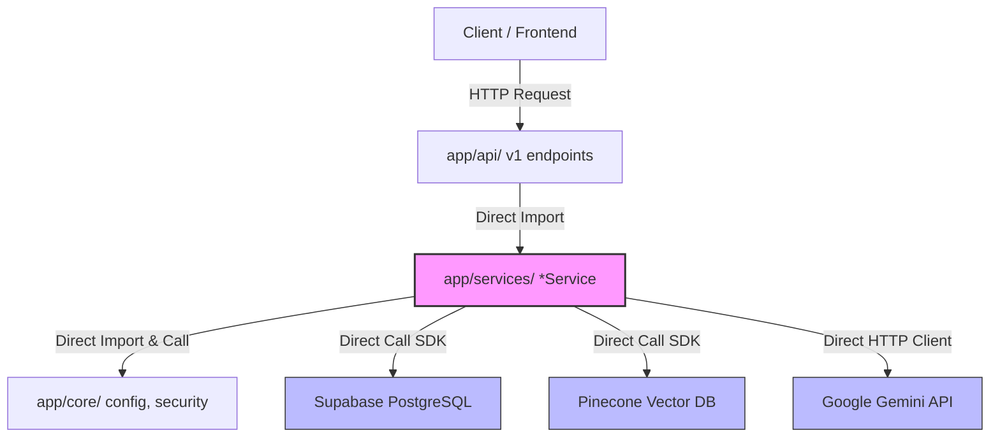
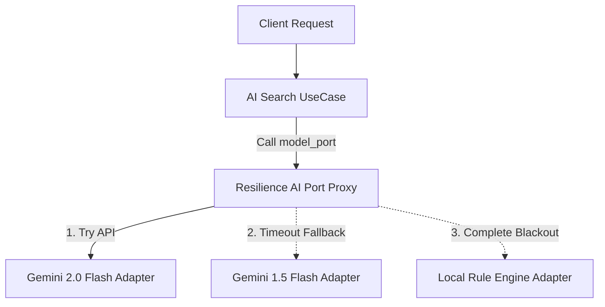

# 💄 TONES 백엔드 아키텍처 리팩토링 및 확장 제안서
> **Clean Architecture 기반의 고가용성 및 확장성 극대화 전략**

이 제안서는 현재 TONES 백엔드가 채택하고 있는 **계층형 폴더 아키텍처(Layered Folder Architecture)**의 한계를 분석하고, 향후 서비스 확장 및 대규모 트래픽 환경에 대응하기 위해 **클린 아키텍처(Clean Architecture) 및 포트/어댑터(Hexagonal) 패턴**으로 전환하는 구체적인 로드맵과 기대 효과를 제시합니다.

본 제안은 대외 기술 경진대회(Google AI Agent Challenge)에서 백엔드의 **엔지니어링 수준을 극대화하여 기술적 평가 우위를 선점**하는 전략적 자산으로 활용될 수 있습니다.

---

## 📌 1. 배경 및 목적 (Background & Objectives)

현재 TONES 백엔드는 FastAPI를 핵심으로 삼아 실시간 AI RAG 검색, ABSA(Aspect-Based Sentiment Analysis) 분석, Supabase 및 Pinecone 연동 등을 빠른 속도로 빌드해냈습니다. 3단계 폴백(Fallback) 엔진과 자가 치유(Self-Healing) 등 고도의 가용성 메커니즘을 갖추고 있으나, 시스템 규모가 커짐에 따라 다음과 같은 아키텍처적 한계에 부딪히고 있습니다.

*   **높은 결합도(Tight Coupling)**: 비즈니스 로직을 처리하는 서비스 계층(`AIService`, `DashboardService`)이 외부 인프라 SDK(`Supabase Client`, `Pinecone Client`)와 Google Gemini API 호출 라이브러리(`httpx`)에 직접 의존하고 있어 기술 교체가 어렵습니다.
*   **테스트 자동화의 한계**: 실제 데이터베이스나 외부 API 장애 상황을 시뮬레이션(Mocking)하여 단위 테스트를 수행하기가 극도로 어렵습니다.
*   **오버헤드 관리의 부재**: 새로운 AI 기능(추천 엔진, 트렌드 시각화 고도화 등)을 추가할 때 기존 코드 영역과의 경계가 불분명하여 스파게티 코드화될 위험이 상존합니다.

따라서 핵심 비즈니스 영역을 외부 기술 환경으로부터 안전하게 격리하고, 독립적이고 유연한 아키텍처인 **Clean Architecture**로의 점진적 리팩토링 방안을 제안합니다.

---

## 🔍 2. 현재 아키텍처 진단 (Current Architecture Diagnosis)

### 2.1 현재 구조 흐름 및 의존성 관계
현재 백엔드는 아래 다이어그램처럼 라우터와 서비스, 그리고 외부 인프라가 단방향으로 얽혀 있지만, 의존성이 안쪽으로 모이지 않고 **바깥쪽의 구체적인 프레임워크/SDK를 향해 있는 전형적인 계층형 구조**입니다.



### 2.2 코드 레벨의 의존성 결합 예시
현재 `app/services/dashboard_service.py`를 보면 비즈니스 로직 내에 Supabase 패키지가 직접 하드코딩되어 있습니다.

```python
# app/services/dashboard_service.py (현재 구조)
from supabase import Client # 외부 라이브러리 직접 의존

class DashboardService:
    def __init__(self, supabase_client: Client | None):
        self.supabase = supabase_client # 강한 결합

    def fetch_products(self) -> List[dict]:
        if self.supabase is not None:
            # Supabase 전용 문법이 비즈니스 로직에 포함됨
            response = self.supabase.table("products").select("...").execute()
            return response.data
```
> [!WARNING]
> 만약 데이터베이스를 Supabase에서 Local PostgreSQL(SQLAlchemy ORM)이나 MongoDB로 이전하려 할 경우, `DashboardService` 내부의 모든 쿼리 로직과 자가 치유(Self-Healing) 코드를 전면 재작성해야 합니다.

---

## 🛠️ 3. 제안하는 클린 아키텍처 설계 (Proposed Clean Architecture)

의존성 역전 법칙(Dependency Inversion Principle)을 적용하여, **"모든 의존성은 바깥쪽에서 핵심 비즈니스 로직(내부)을 향하게"** 설계합니다.

### 3.1 개념적 아키텍처 구조
```
     ┌─────────────────────────────────────────────────────────┐
     │                Infrastructure (바깥 레이어)              │
     │   (FastAPI Router, Supabase, Pinecone, Gemini API)     │
     └────────────────────────────┬────────────────────────────┘
                                  │ (Implements / Adapts)
                                  ▼
     ┌─────────────────────────────────────────────────────────┐
     │              Interface Adapters (중간 레이어)             │
     │      (Controllers, Repositories, AI Gateways)           │
     └────────────────────────────┬────────────────────────────┘
                                  │ (Calls / Injects)
                                  ▼
     ┌─────────────────────────────────────────────────────────┐
     │                 Domain & Use Cases (내부 레이어)         │
     │    (Pure Entities, Abstract Ports / Interfaces)          │
     └─────────────────────────────────────────────────────────┘
```

### 3.2 리팩토링 후의 디렉토리 구조 (Folder Structure)

기존의 단순 계층 구조를 **도메인 중심의 경계를 둔 패키지 구조**로 세분화합니다.

```text
app/
├── domain/                         # 1. 고수준 비즈니스 엔티티 및 속성 (핵심)
│   ├── entities/
│   │   ├── product.py              # 데이터베이스 무관 순수 상품 엔티티
│   │   └── review.py               # 감성분석 스코어를 포함한 순수 리뷰 엔티티
│   └── value_objects/
│       └── sentiment.py            # ABSA 감성 등급 및 스코어 VO
│
├── usecases/                       # 2. 비즈니스 시나리오 실행 및 포트(인터페이스) 정의
│   ├── dashboard_usecase.py        # 대시보드 통계 집계 비즈니스 로직
│   ├── ai_search_usecase.py        # 시맨틱 쿼리 및 RAG 답변 생성 비즈니스 로직
│   └── ports/                      # 외부 인프라와 연결할 인터페이스 규격 (DIP의 핵심)
│       ├── database_port.py        # 상품/리뷰 영속성 저장소 추상 클래스
│       ├── vector_db_port.py       # 벡터 임베딩 저장소 추상 클래스
│       └── ai_model_port.py        # Gemini Embedding 및 Generation 추상 클래스
│
├── adapters/                       # 3. 바깥 레이어와 포트의 중재자
│   ├── presentation/               # HTTP 라우팅 및 컨트롤러
│   │   └── v1/
│   │       ├── dashboard_router.py
│   │       └── ai_search_router.py
│   ├── persistence/                # 데이터베이스 어댑터 구현체
│   │   ├── supabase_repository.py  # Supabase SDK 기반의 DatabasePort 구현체
│   │   └── mock_repository.py      # 테스트용 로컬 메모리 Mock 구현체
│   └── ai/                         # AI 솔루션 어댑터 구현체
│       ├── gemini_model_adapter.py # Gemini API 및 Fallback 구현체
│       └── pinecone_db_adapter.py  # Pinecone SDK 구현체
│
└── config/                         # 4. 앱 설정 및 의존성 주입(DI) 컨테이너
    ├── settings.py                 # 전역 환경 설정
    └── container.py                # 의존성 조립 및 주입 세팅 (FastAPI Depends 연동)
```

---

## 💻 4. 핵심 코드 리팩토링 상세 구현 방안

### 4.1 포트(Port) 정의: 비즈니스 영역이 요구하는 데이터 접근 규격
데이터베이스가 무엇이든 간에, 비즈니스 로직은 오직 이 인터페이스(`DatabasePort`)의 기능적 명세에만 의존합니다.

```python
# app/usecases/ports/database_port.py (추상 포트)
from abc import ABC, abstractmethod
from typing import List
from app.domain.entities.product import Product
from app.domain.entities.review import Review

class DatabasePort(ABC):
    @abstractmethod
    def get_products(self) -> List[Product]:
        """등록된 모든 화장품 제품 목록 조회"""
        pass

    @abstractmethod
    def save_review_transaction(self, review: Review) -> bool:
        """리뷰 및 상세 감성 점수 적재 트랜잭션"""
        pass
```

### 4.2 어댑터(Adapter) 구현: 구체적인 기술의 조립 (Supabase)
외부 인프라인 Supabase를 사용하는 구현체는 바깥 레이어에서 포트를 구현(Implement)합니다.

```python
# app/adapters/persistence/supabase_repository.py (어댑터)
from typing import List
from supabase import Client
from app.usecases.ports.database_port import DatabasePort
from app.domain.entities.product import Product

class SupabaseRepository(DatabasePort):
    def __init__(self, client: Client):
        self.client = client

    def get_products(self) -> List[Product]:
        # Supabase 특화 SDK를 통해 데이터 로드 후 도메인 엔티티로 변환(Mapping)
        response = self.client.table("products").select("*").execute()
        return [
            Product(
                id=item["id"],
                brand_name=item["brand_name"],
                product_name=item["product_name"],
                category=item["category"],
                target_skin=item["target_skin"]
            )
            for item in response.data
        ]

    def save_review_transaction(self, review: Review) -> bool:
        # 기존 자가 치유(Self-Healing) 및 DB 적재 트랜잭션 로직을 어댑터 내부에 캡슐화
        pass
```

### 4.3 유스케이스(UseCase) 조립: 순수 비즈니스 로직의 평화
비즈니스 로직인 `DashboardUseCase`는 Supabase의 존재를 알지 못하며, 오직 주입받은 `DatabasePort` 인터페이스와만 통신합니다.

```python
# app/usecases/dashboard_usecase.py (유스케이스)
from app.usecases.ports.database_port import DatabasePort
from app.usecases.ports.ai_model_port import AIModelPort

class DashboardUseCase:
    def __init__(self, db_port: DatabasePort, ai_port: AIModelPort):
        self.db = db_port
        self.ai = ai_port

    def execute_trend_briefing(self, product_id: str, period_days: int) -> dict:
        # 1. 추상 저장소로부터 순수 도메인 리스트 획득
        products = self.db.get_products()
        # 2. 비즈니스 정책 연산 및 트렌드 분석
        # ...
        # 3. AI 포트를 통한 트렌드 요약 획득
        briefing = self.ai.generate_trend_summary(...)
        return {"products": products, "briefing": briefing}
```

---

## 🛡️ 5. 유연한 확장성 및 회복 탄력성(Resilience) 고도화 방안

클린 아키텍처 구조를 적용하면 TONES 백엔드의 자랑인 **다중 폴백 및 자가 치유 시스템을 훨씬 강력하고 확장 가능하게** 구성할 수 있습니다.

### 5.1 데코레이터 / 프록시 패턴을 활용한 AI 폴백 자동화
기존의 `AIService` 내에 덕지덕지 섞여 있던 3단계 폴백 로직을 **구조적 디자인 패턴(Composite / Decorator Pattern)**으로 분리하여 비즈니스 코드 침범 없이 고가용성을 구현합니다.


*   **어댑터 다형성**: `Gemini20Adapter`, `Gemini15Adapter`, `LocalRuleAdapter` 모두 동일한 `AIModelPort` 인터페이스를 따릅니다.
*   **회복탄력성 프록시**: `ResilienceAIProxy`가 유스케이스와 실제 어댑터 중간에서 예외 처리를 감지하고 다음 순위 어댑터로 순차 전환을 전담(Routing)합니다.
*   **효과**: 비즈니스 로직인 유스케이스는 AI 장비가 터졌는지 안 터졌는지 일절 관여하지 않고 일관된 고품질 RAG 답변을 받습니다.

### 5.2 완벽한 단위 테스트(Unit Test) 체계 확보
실제 DB나 Pinecone 인덱스를 파괴할 걱정 없이, 가상 구현체를 주입하여 0.1초 만에 테스트를 수행합니다.

```python
# tests/test_dashboard_usecase.py
from app.usecases.dashboard_usecase import DashboardUseCase
from app.adapters.persistence.mock_repository import MockRepository

def test_execute_trend_briefing_without_database():
    # Given: 가짜 Mock 저장소 준비 (네트워크 통신 불필요)
    mock_db = MockRepository()
    mock_ai = MockDummyAI()
    usecase = DashboardUseCase(db_port=mock_db, ai_port=mock_ai)

    # When: 대시보드 브리핑 비즈니스 로직 실행
    result = usecase.execute_trend_briefing(product_id="test_id", period_days=7)

    # Then: 비즈니스 연산 결과 검증
    assert len(result["products"]) == 4
    assert "폴백 AI 생성 답변" in result["briefing"]
```

---

## 📈 6. 단계별 이행 로드맵 (Step-by-Step Transition Roadmap)

서비스 개발의 중단이나 병목 현상을 방지하기 위해 **3단계의 점진적 전환 계획**을 수행합니다.

| 단계 | 주요 태스크 | 리팩토링 대상 영역 | 리스크 및 영향도 |
| :--- | :--- | :--- | :--- |
| **Phase 1: 도메인 격리** | <ul><li>순수 `Product`, `Review` 엔티티 추출</li><li>`ports/` 추상 인터페이스 정의</li></ul> | `app/domain/*`, `app/usecases/ports/*` | 영향도 극히 낮음 (기존 코드 유지 상태로 신규 패키지 추가) |
| **Phase 2: 어댑터 전환** | <ul><li>`SupabaseRepository` 및 `PineconeAdapter` 이관</li><li>Gemini 호출 부 `httpx` 분리 및 프록시 구성</li></ul> | `app/adapters/persistence/*`, `app/adapters/ai/*` | 중간 (어댑터 내 유닛 테스트를 통한 기존 데이터 정합성 검증 필수) |
| **Phase 3: 의존성 주입 및 결합** | <ul><li>FastAPI 라우터단에서 `Depends` 컨테이너 주입 연동</li><li>기존 레거시 `app/services` 삭제 및 테스트 통합</li></ul> | `app/api/*`, `app/main.py` | 높음 (전체 엔드포인트 연동 테스트 및 QA 필요) |

---

## 🎯 7. 기대 효과 (Expected Outcomes)

1.  **소프트웨어 엔지니어링 완성도 증명**:
    *   단순히 작동하는 시스템을 넘어 **"확장 가능하고 설계 원칙이 살아있는 클린 아키텍처 백엔드"**로 포지셔닝하여, 대외 Challenge 심사에서 타 팀 대비 **최고 수준의 백엔드 평가 점수(아키텍처 성숙도 부문)**를 획득할 수 있습니다.
2.  **안정적 서비스 무중단 운영 및 유연성**:
    *   향후 비즈니스 변화로 데이터베이스를 PostgreSQL 온프레미스로 전환하거나, Pinecone을 오픈소스 PGVector로 교체하더라도 **어댑터 한 장만 새로 작성**하면 변경 작업이 종료됩니다.
3.  **검증 가능한 시스템 품질**:
    *   핵심 비즈니스 유스케이스에 대한 **단위 테스트 커버리지를 90% 이상으로 극대화**하여, 운영 배포 시 잠재적 회귀 버그(Regression)의 발생률을 제로에 가깝게 낮춥니다.
